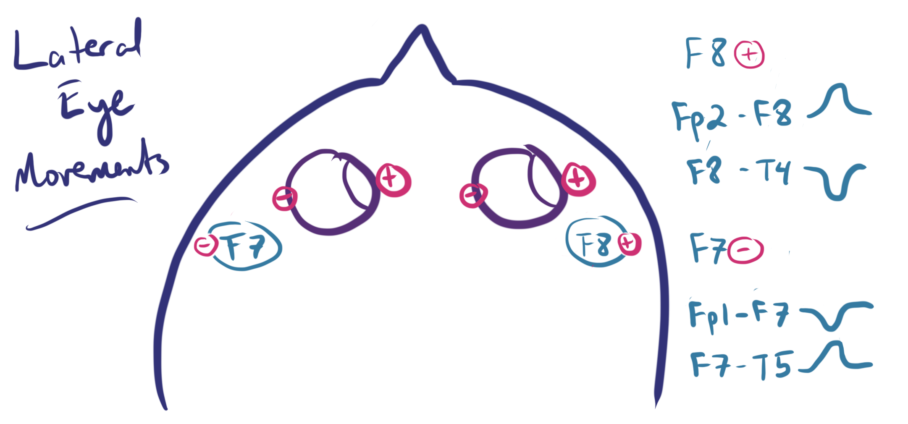

# Introduction
Electroencephalography (EEG) is a widely used non-invasive technique for monitoring electrical activity in the brain. This technology has applications across various fields, including neuroscience, cognitive science, and medical diagnostics. One particularly interesting application of EEG data is in the classification of different cognitive states, such as distinguishing between open and closed eye states. This distinction is valuable for several practical applications, including sleep studies, fatigue monitoring, and brain-computer interface development.
									

There's a high difference potential between the front and the back of an eye, which makes this problem ideal for our needs since eeg sensors can perfectly capture this potential difference.The electrodes placed as follow on the next figure are crucial to detect eye movements or rather the difference potential when the changes state from closed to open or vice versa.

### Overview of the Project
The objective of this project is to develop a robust model capable of classifying EEG data to determine whether the subject's eyes are open or closed. To achieve this, we are leveraging NeuroEvolution of Augmenting Topologies (NEAT), an evolutionary algorithm that evolves artificial neural networks. NEAT is particularly well-suited for this task because it optimizes both the structure and the weights of the neural networks, potentially discovering novel and efficient architectures for EEG classification.

### Key Components:
##### EEG Dataset:

The dataset consists of EEG recordings that capture brain activity in both open and closed eye states.
These recordings provide a rich source of information due to the distinct patterns associated with each state, making the task of classification feasible.

##### Feature Extraction:

EEG data are preprocessed to extract relevant features that can effectively represent the eye states.
This may include time-domain features, frequency-domain features, and other signal characteristics that enhance the model's ability to discriminate between the states.

##### Model Optimization with NEAT:

NEAT is employed to optimize the neural network model. This evolutionary algorithm iteratively improves the model by evolving both its topology and weights.
NEAT's ability to adapt the network structure allows for the discovery of highly efficient architectures tailored to the specific characteristics of EEG data.

##### Fitness Function:

The fitness of the evolved models is evaluated using the Matthews Correlation Coefficient (MCC). MCC is a robust metric for binary classification tasks, particularly when dealing with imbalanced datasets.
MCC takes into account true and false positives and negatives, providing a comprehensive measure of the model's performance.
##### Training and Validation:

The dataset is split into training and validation sets to ensure that the model generalizes well to unseen data.
The evolutionary process continues until the fitness function converges, indicating that the optimal model has been found.
##### Evaluation and Analysis:

The final model is evaluated on a separate test set to assess its real-world performance.
Detailed analysis of the model's predictions, including confusion matrices and other performance metrics, is conducted to understand its strengths and limitations.

## Conclusion
This project aims to harness the power of NEAT to create an efficient and accurate model for classifying EEG data into open and closed eye states. By optimizing the neural network's architecture and leveraging the Matthews Correlation Coefficient as the fitness function, we strive to achieve high classification performance. The outcomes of this project have the potential to contribute significantly to fields that rely on EEG data, offering insights and tools for better understanding and monitoring cognitive states, And we hope that the idea can be used in more complex projects revolving around more complex EEG classification.